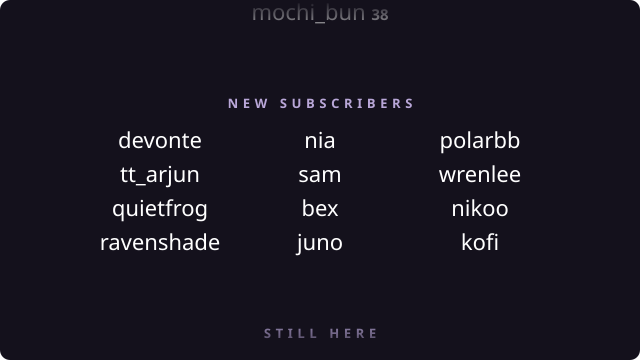

# 🌅 Stream End Credits

Thank everyone who showed up, as film credits, at the end of your stream.

<p align="center">
  
</p>

The overlay watches your chat all stream and collects everyone who subscribed, gifted a
sub, raided you, cheered or donated — including donations to a charity fundraiser. Switch
to your ending scene and the credits roll. Switch away and they stop. Nothing is typed in
chat.

## Setup

Add one **Browser Source** to your ending scene:

1. Go to the scene you switch to at the end of your stream
2. **Sources → + → Browser**
3. Paste your link, set **Width 1920**, **Height 1080**
4. **Untick "Shutdown source when not visible"**, then click OK

```
https://abdullahmorrison.github.io/stream-end-credits/credits.html?channel=YOUR_CHANNEL
```

Or pick how it looks on the [setup page](https://abdullahmorrison.github.io/stream-end-credits/),
which reads the same params as the overlay — `?channel=you&firsts=on&columns=2` opens it
with those already set.

**Step 4 matters.** The overlay only collects while it is loaded. Tick that box and it
starts when you switch to the ending scene — after the stream it is meant to be thanking —
and rolls empty credits with nothing to say why.

If you reload the source while the ending scene is already up, switch away and back. OBS
reports scene *changes*, not the current scene.

## What gets credited

| Section | Who |
|---|---|
| Raided by | Raiders, with how many they brought |
| New subscribers | New subs, and everyone gifted one |
| Resubs | Returning subscribers, with their month count |
| Gifted subs | Gifters, with how many they gave |
| Cheered | Bits, added up per person |
| Donations | Tips your donation bot announced, added up per person |
| For charity | Donations to a named cause or fundraiser |
| First time in chat | Optional (`firsts=on`) |

Empty sections are left out. **Follows are not included** — they are the one event Twitch
keeps out of chat, and reading them needs an OAuth token that expires every few hours with
no way to renew itself. Everything else arrives free, which is what keeps this a link you
paste in once.

## Settings

All settings are URL params; the setup page writes them for you.

| Param | Default | Meaning |
|---|---|---|
| `channel` | *(required)* | Twitch channel to read |
| `title` | `Thank you for watching` | Opening card heading. Empty for none |
| `speed` | `90` | Scroll pace in pixels per second |
| `duration` | *(off)* | Fixed runtime in seconds. Overrides `speed` |
| `columns` | `3` | Columns of names. Drops for a short list |
| `align` | `center` | How names line up in their columns — `left`, `right` |
| `firsts` | `off` | Include first-time chatters |
| `donations` | `on` | Include donations and charity donations |
| `donationBots` | *(none)* | Extra bot logins to read donations from, comma-separated |
| `sessionHours` | `12` | How old a stored roster may be before it is discarded |
| `backdrop` | `0` | Dim behind the credits, `0`–`1` |
| `debug` | `off` | Status panel plus keyboard tests |
| `demo` | `off` | Rolls a made-up roster |

## How it works

Anonymous `justinfan` IRC over WebSocket — no OAuth, no bot account, no backend. Subs,
resubs, gift subs and raids arrive as `USERNOTICE` tags; bits ride on an ordinary message.

The roster is saved to `localStorage` every couple of seconds, so a source refresh or an
OBS restart mid-stream does not empty the credits. A roster older than `sessionHours` is
discarded rather than rolled.

The trigger is `obsSourceActiveChanged` — *active*, not *visible*, because in Studio Mode
a source is visible while its scene sits in preview. Outside OBS the overlay rolls on
load, which is what makes the local server and the setup preview work.

The roll is DOM and CSS. The scroll runs on `requestAnimationFrame` rather than a CSS
animation, because the distance is not known until the reel is measured and it has to stop
cleanly when the scene changes. The loop does not run when nothing is rolling.

**Donations are read out of your bot's chat message.** Twitch has no donation event —
money that did not go through Twitch never reaches the IRC tags everything else here comes
from. What does arrive is the line StreamLabs, StreamElements, Ko-fi, Muxy,
DonationAlerts, Tiltify or Extra Life post in chat, so that is what is parsed. Only those
bots are read: otherwise anybody could type themselves into the credits with "I just
donated $50". Using something else, or a rewritten template? Add its chat name with
`donationBots=yourbot`, and check the reel with `debug=on` before you rely on it — an
announcement no pattern matches is a donation nobody sees, and nothing errors. Amounts are
shown in the currency the bot wrote them in and never converted. A donation naming a cause
("$25 to Extra Life") rolls under **For charity**; anything through Tiltify or Extra Life
counts as charity whether or not the line names one.

**Gift bombs are announced twice** — once as `submysterygift` with the real total, then as
one `subgift` per recipient from the same login. Counting both doubles the gifter's number
with no error anywhere, so the batch is authoritative and the follow-ups only credit
recipients.

## Development

```
node serve.js       # http://localhost:4748
npm test            # parsing, roster and config logic
```

No dependencies, no build step — the files in this repo are the deployed site.

```
http://localhost:4748/credits.html?channel=tenzinniznet&demo=on&debug=on
```

With `debug=on`: `R` roll, `C` stop, `F` add a fake credit, `X` reset. The panel also logs
every `obs*` event your OBS actually sends, which is how to check the event names rather
than trusting the docs.

Every pull request that touches the reel gets it rendered by CI and posted to the pull
request as pictures — the whole reel as one tall image, plus the roll as an animation.

```
npm install —no-save playwright        # not saved: the site keeps its zero dependencies
node tools/capture-demo.mjs             # -> demo-out/
```
